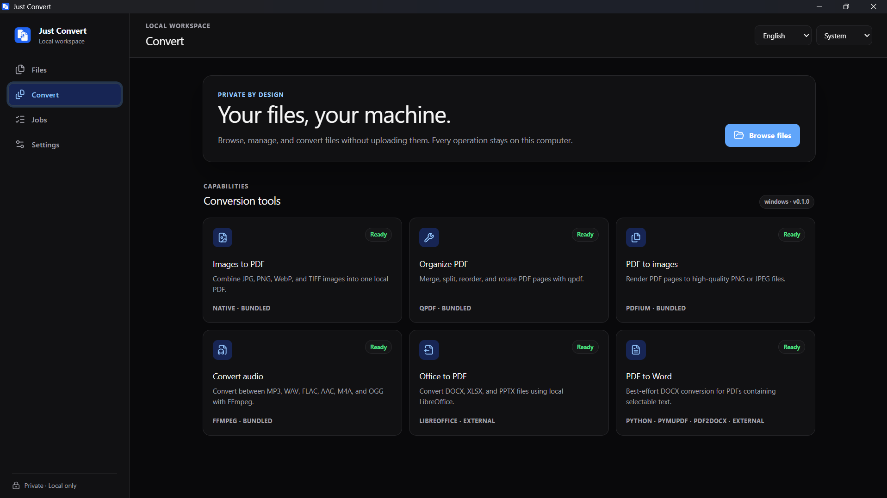
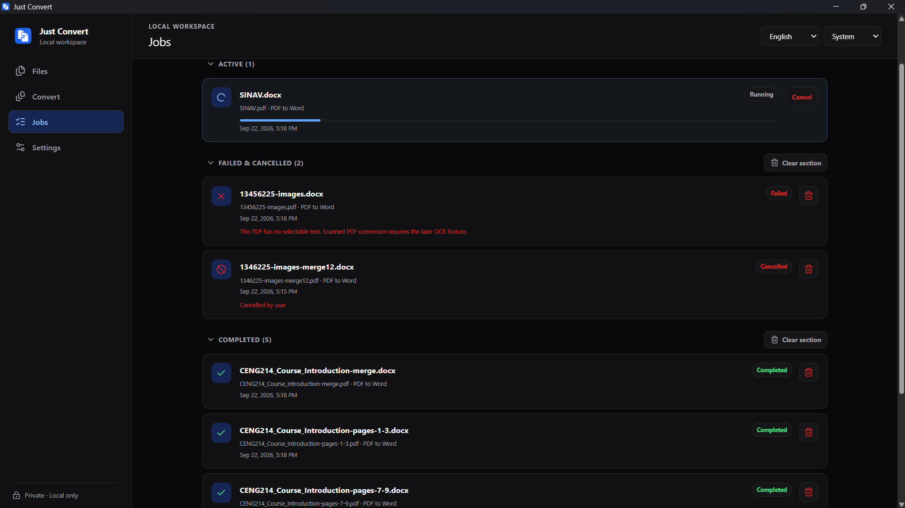
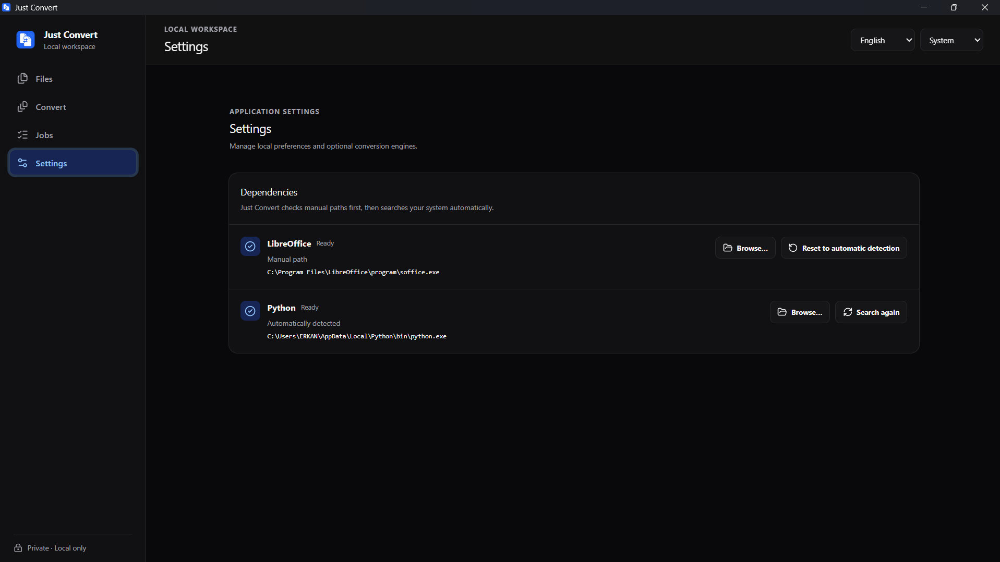

# Just Convert

A local-first desktop file manager and file converter for Windows 10 and Windows 11 x64.

Licensed under your choice of the [MIT or Apache 2.0 license](LICENSE).

## Windows v1 Distribution

Windows v1 is distributed only as an NSIS installer. MSI/WiX packaging is deferred to a later release.

The v1 executable and installer are unsigned. Windows SmartScreen may therefore display an "unrecognized app" or "unknown publisher" warning, especially on newly published downloads without an established reputation. Download releases only from the project's official repository and verify the published SHA-256 checksum before running the installer. Code signing is intentionally deferred for v1 because trusted certificates and signing infrastructure add recurring cost and release-process complexity.

## Third-Party Components

This application bundles FFmpeg under GPL v3, qpdf, PDFium, and other third-party components for selected conversion features. Each component remains subject to its own license and redistribution terms; see [Third-Party Licenses](docs/licenses/THIRD_PARTY_LICENSES.md) for versions, sources, checksums, attribution, and full license references.

PDF-to-Word uses a separately installed Python runtime with PyMuPDF (AGPL v3 or commercial) and pdf2docx; none of these dependencies is included in the installer, distributed by the project, or linked into the Rust core. The project treats these as optional external subprocess dependencies, like LibreOffice, as detailed in the third-party license record.

## Dependencies

- FFmpeg and qpdf are bundled with Just Convert; no separate installation is needed.
- LibreOffice must be installed separately for Office-to-PDF conversion. Download it from the [official LibreOffice website](https://www.libreoffice.org/download/download-libreoffice/).
- Python 3.10 or newer, plus the `pymupdf` and `pdf2docx` packages, must be installed separately for PDF-to-Word conversion. Install the packages with `pip install pymupdf pdf2docx`.
- All other features work out of the box with no additional setup.

## Screenshots

## Development

The desktop application uses Tauri 2, Rust, React, TypeScript, and pnpm. Install dependencies with `pnpm install`, run the browser UI with `pnpm dev`, run the desktop application with `pnpm tauri dev`, and execute the complete quality gate with `pnpm check`. The quality gate also verifies the checksums in `vendor/manifests/`, required license records, and every configured installer resource.

Audio conversion supports MP3, WAV, FLAC, AAC, M4A, and OGG through the bundled FFmpeg executable. M4A outputs use FFmpeg's AAC encoder in an M4A container. A single file or every supported audio file at the top level of a selected folder can be queued for conversion. All folder batches run sequentially through the same persistent, single-worker local queue backed by a local SQLite history database; originals are preserved, subfolders are skipped, and output name collisions receive an incrementing suffix instead of being overwritten.

PDF tools support merge, split, page reorder, and page rotation through the bundled qpdf executable. PDF outputs are staged and validated before publication, source files are preserved, and existing outputs are not overwritten.

Image tools combine JPG, PNG, WebP, and TIFF files into automatically oriented A4 PDFs and render PDF pages to PNG or JPEG at 150 or 300 DPI. Images-to-PDF folder mode can either combine all supported top-level images into one PDF in filename order or queue one single-page PDF per image. PDF-to-image folder mode gives every source PDF its own collision-safe output subfolder. Rendered filenames include their format and normal/high quality setting; existing names receive an incrementing suffix instead of blocking the conversion. These conversions remain local, use staged outputs, and run through the same persistent queue.

Office-to-PDF conversion supports individual files or top-level folder batches of DOCX, XLSX, and PPTX through a detected local LibreOffice installation. LibreOffice is not bundled; when it is unavailable, the app provides an official installation link and keeps the rest of the tools usable.

PDF-to-Word conversion supports individual files or top-level folder batches of digitally generated PDFs with selectable text through a detected Python 3.10+ installation containing PyMuPDF and pdf2docx. These dependencies are not bundled. Scanned image-only PDFs become failed history entries with an explanatory reason until the later optional OCR phase, and complex layouts remain best-effort.

The Jobs panel separates active, failed/cancelled, and completed work. Each section is collapsible, shows its entry count, and remembers its state locally; a running job forces Active open. Active jobs remain cancel-only, failure entries show their available reason, and history cleanup never deletes converted output files.

## Post-v1 Roadmap

Cross-platform support is a possible future roadmap item, not a current commitment. Optional Tesseract OCR for scanned PDFs and parallel queue execution are also deferred until after the Windows v1 release.

Architectural decisions are recorded in [`docs/architecture/`](docs/architecture/README.md). Conversion engines must remain behind typed Rust adapters and may not be launched directly by frontend code.
